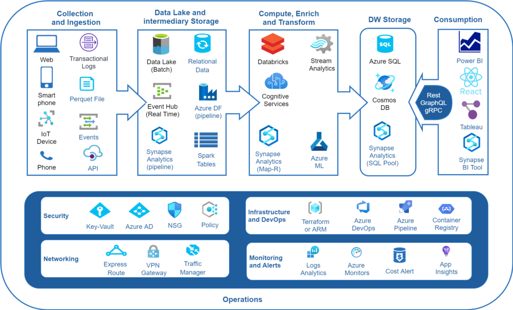

# Data Engineer
คือบุคคลที่ทำหน้าที่ในการ**จัดการข้อมูล**ทั้งหมดของระบบ ตั้งแต่ระบุชนิดของข้อมูล **วางโครงสร้าง**การเข้าออก ทั้งระบบหลังบ้าน และการใช้งานหน้าบ้าน รวมไปถึงเป็นผู้รับผิดชอบในการ**ทำให้ข้อมูลเป็นระเบียบสวยงาม และพร้อมใช้** เพื่อส่งต่อให้ Data Scientist นำไปต่อยอดได้ ชื่อตำแหน่งที่ใกล้เคียง -> Cloud Engineer, DevOpes Engineer, Data Architect, System Engineer etc.

# Big Data
Big data เป็นคำศัพท์คำหนึ่งซึ่งอธิบายถึงปริมาณข้อมูลที่มหาศาล ทั้งแบบ Structured และ Unstructured ซึ่งปะปนอยู่มากมายในการทำธุรกิจในแต่ละวัน หากแต่ไม่ใช่ปริมาณของข้อมูลที่เป็นสิ่งสำคัญ สิ่งสำคัญก็คือการที่องค์กรจัดการกับข้อมูลต่างหาก การวิเคราะห์ Big Data นำไปสู่ข้อมูลเชิงลึกเพื่อการตัดสินใจที่ดีกว่าและการเคลื่อนไหวในกลยุทธ์ธุรกิจ

Big Data มีคุณลักษณะสำคัญอยู่ 4 อย่างคือ ต้องเป็นข้อมูลที่มีจำนวนมากขนาดมหาศาล (Volume) มีความซับซ้อนหลากหลาย (Variety) มักจะเปลี่ยนแปลงอย่างรวดเร็วอยู่ตลอดเวลา (Velocity) และยังไม่สามารถนำมาใช้เป็นข้อมูลที่สมบูรณ์เพื่อนำมาใช้ในการประกอบการพิจารณาได้ (Veracity)

## Big Data Platform
คือระบบที่สร้างขึ้นมาเพื่อช่วยให้เราสามารถควบคุมดูและ Big data ได้แบ่งออกได้ 2 ประเภทหลัก ๆ
1. ระบบที่ติดตั้งบนเซิร์ฟเวอร์ของบริษัท (**On-Premise**)

2. ใช้บริการระบบบนเซิร์ฟเวอร์ผ่านระบบอินเทอร์เน็ต (**Cloud Computing**) ส่วนใหญ่จะเป็นการเช่าเซิร์ฟเวอร์จากผู้ให้บริการเจ้าใหญ่ ๆ เช่น AWS, Microsoft Azure, Google Cloud Platform เป็นต้น

# Types of Data
## Structured Data

