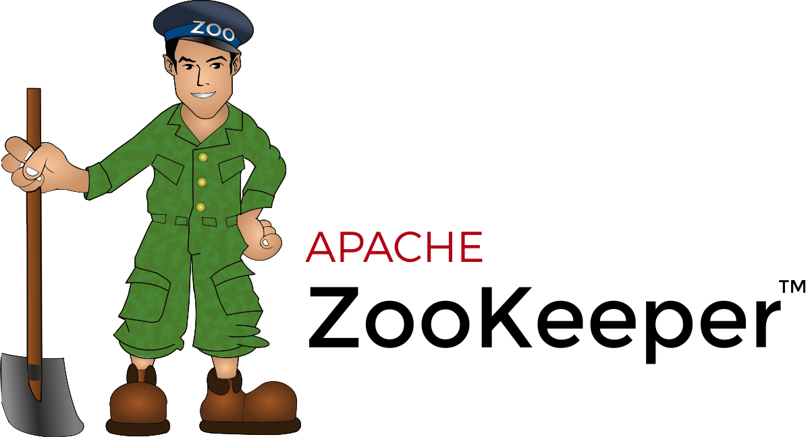

# What is Hadoop
Hadoop คือ Open-source software framework ที่มีเครื่องมือภายใน ecosystem ที่หลากหลาย และยืดหยุ่น เพื่อตอบโจทย์การประมวลผล หรือวิเคราะห์ Big data

# Hadoop Architecture
Hadoop จะมีรูปแบบเป็น Master-Slave Architecture ซึ่งมีการวางเซิร์ฟเวอร์หลาย ๆ ตัวรวมกันเรียกว่า Hadoop Cluster โดยให้เครื่อง master คอยจัดการ และเครื่อง slave ทำ task ที่ได้รับ

# Hadoop Core Components
Hadoop ประกอบไปด้วย 4 ส่วนหลัก (components) ได้แก่ HDFS, YARN, MapReduce และ Common Utilities ตามรูปด้านล่าง

## MapReduce
คือวิธีการประมวลผลข้อมูลที่่ทำบน Hadoop cluster โดย Application Master จะหาบล็อกข้อมูลที่ต้องการจาก metadata ที่มีใน Name Node หลังจากนั้น Application Master จะบอก Resource Manager ให้เริ่มกระบวนการ MapReduce บน node ที่มีบล็อกข้อมูลที่ต้องการอยู่ การประมวลผลจะเกิดบน slave node เพื่อลดการใช้ bandwidth และเพิ่มประสิทธิภาพการทำงานของ cluster เมื่อกระบวนการ MapReduce เริ่มแล้ว Resource Manager จะบอก Application Master ให้ดูแล และติดตามการทำงานของ MapReduce

โดยข้อมูลที่รับมาจะถูก map, shuffle และ reduce ผลลัพธ์ที่ได้จาก MapReduce จะถูกเก็บ และทำซ้ำไว้ใน HDFS

Hadoop server ที่ทำหน้าที่ในการ map และ reduce จะถูกเรียกว่า Mapper และ Reducer ตามลำดับ

Resource Manager จะเป็นส่วนที่ตัดสินใจว่าจะใช้ mapper เท่าไหร โดยขึ้นอยู่กับขนาดของข้อมูล และหน่วยความจำที่มีบน mapper server

### Map Phase
กระบวนการ map จะใส่สูตรทางตรรกะให้บล็อกข้อมูลใน HDFS โดยสูตรเหล่านี้สามารถใช้งานบนบล็อกข้อมูลหลาย ๆ บล็อกพร้อมกันได้ เราเรียกสูตรเหล่านี้ว่า Input Split ซึ่งมันคือการ map ข้อมูลให้กลายเป็น key-value pair

หลังจากนั้นจะ map อีกครั้ง โดยทำทุก key-value pair และสร้างเป็นเซ็ทของ key-value ใหม่ที่มีขนาดเล็กลง

### Shuffle and Sort Phase
การ shuffle คือนำ key-value pair ไปสับเปลี่ยน โดยจัดกลุ่มด้วย key และตามค่าของมัน โดย Reduce Phase จะเริ่มเมื่อจัดกลุ่มจนกลายเป็นไฟล์เดียว

กระบวนการ shuffle และการเรียงข้อมูลจะทำงานไปพร้อมกัน แม้ว่าผลลัพธ์จากการ map จะได้จาก mapper node แต่การจัดกลุ่ม และเรียงจะถูกทำบน reducer node

### Reducer Phase
กระบวนการ reduce จะทำการรวมไฟล์ให้สอดคล้องกับ mapped key ผลลัพธ์ที่ได้ออกมาจะกลายเป็น key-value pair ใหม่ และถูกนำไปจัดเก็บบน HDFS

## Hadoop Distributed File System (HDFS)
เป็นส่วนหลักในการจัดเก็บข้อมูลที่อยู่บน server ทั้งหมด ข้อมูลจะถูกแบ่งออกเป็นบล็อก ๆ ตามขนาดของข้อมูล แต่ละบล็อกข้อมูลจะมีขนาดไม่เกิน 128 MB ถูกทำซ้ำอีก 3 ครั้ง และจัดเก็บท่ามกลาง node และ rack ที่เรามีทั้งหมด

**Data Node** ทำหน้าที่ประมวลผล และจัดเก็บบล็อกข้อมูล ส่วน **Name Node** ดูแลจัดการ Data Node เก็บบล็อก metadata และควบคุมการเข้าถึงของ client

### Name Node
เป็นที่จัดเก็บที่มาของข้อมูล (metadata) ของบล็อกข้อมูลทั้งหมด เช่น ชื่อไฟล์, การเข้าถึงไฟล์, ID, ที่จัดเก็บ, จำนวนที่ทำซ้ำ จะถูกเก็บไว้ใน fsimage บนหน่วยความจำของ Name Node

### Secondary Name Node
เป็น backup ของ Name Node โดยจะโหลดข้อมูล fsimage แก้ไข log จาก Name Node และรวมเข้าด้วยกันกับ fsimage ที่แก้ไขแล้วสามารถดึงข้อมูลกลับมายัง Name Node หลักเพื่อใช้แทน fsimage ที่เสียได้

### Data Node
แต่ละ Data Node ใน cluster จะใช้การประมวลผลเบื้องหลัง (background process) ในการเก็บบล็อกข้อมูลบน slave server

Data Node จะสื่อสาร และรับคำสั่งจาก Name Node ประมาณ 20 ครั้งต่อนาที และ Data Node จะรายงานสถานะ และความสมบูรณ์ของบล็อกข้อมูลกลับไปที่ Name Node ชั่วโมงละครั้ง นอกจากนี้ Name Node ยังสามารถสั่งให้สร้าง-ลบบล็อกข้อมูลที่ทำซ้ำ หรือลดจำนวนบล็อกข้อมูลในแต่ละ node ได้เช่นกัน

โดยปกติแล้ว HDFS จะสร้างบล็อกข้อมูลซ้ำเพิ่มมา 3 บล็อกเก็บในแต่ละ Data Node การจัดเก็บบล็อกข้อมูลจะเป็นไปตามกฏ **Rack Aware Placement** พูดโดยสรุปคือ Data Node จะไม่สามารถเก็บบล็อกข้อมูลทั้งหมดใน rack เดียวกัน (Rack คือ node หลาย ๆ node รวมกันใน cluster)

### Rack Aware Placement Policy
กฏถูกสร้างขึ้นเพื่อเมื่อ rack เราพัง จะไม่ได้ทำให้บล็อกข้อมูลหลัก และบล็อกที่ทำซ้ำขึ้นมาหายไปพร้อมกันทั้งหมด โดยจะมีกฏดังต่อไปนี้
- บล็อกข้อมูลแรกจะถูกเก็บไว้ใน node เดียวกับ client
- บล็อกข้อมูลที่ 2 จะถูกสุ่มจัดเก็บไว้ใน node ที่อยู่คนละ rack กับบล็อกข้อมูลแรก
- บล็อกข้อมูลที่ 3 จะถูกเก็บไว้คนละ node กับบล็อกข้อมูลที่ 2 แต่อยู่ใน rack เดียวกัน
- บล็อกข้อมูลที่ถูกทำซ้ำเพื่มที่เหลือจะถูกสุ่มเก็บใน rack ทั้งหมดที่มี

กล่าวโดยสรุปคือกฏนี้บังคับให้บล็อกข้อมูลทั้งหมดจะไม่ถูกจัดเก็บใน Data Node เดียวกัน และจำกัดให้แต่ละ rack มีบล็อกข้อมูลไม่เกิน 2 บล็อก

rack มีโอกาสพังน้อยกว่า node แต่ HDFS ทำเพื่อให้มั่นใจว่าข้อมูลเราจะพร้อมใช้งานเสมอ และเก็บบล็อกข้อมูลไว้อย่างน้อย 1 บล็อกในแต่ละ rack บน cluster เรา

## Yet Another Resource Negotiator (YARN)
เป็นส่วนที่จัดการทรัพยากรภายใน Hadoop cluster ระหว่าง HDFS และการทำ MapReduce

### Resource Manager
ทำหน้าที่ควบคุมทรัพยากรที่ใช้ในการประมวลผลภายใน cluster ทั้งหมด จุดประสงค์หลักของมันคือ
1. การกำหนดทรัพยากรที่ใช้ให้แก่ application บน slave node 
2. ดูแลภาพรวมของ process ที่กำลังทำ และกำลังจะทำ 
3. รับมือกับความต้องการทรัพยากร จัดหาเวลาที่จะทำ และให้ทรัพยากรตามลำดับ
Resource Manager นั้นมีความสำคัญกับ Hadoop มาก ดังนั้นมันจึงควรทำงานอยู่บน master node ที่มีการดูแลเป็นพิเศษ

### Node Manager
แต่ละ slave node จะมีส่วนของ Node Manager ดูแลในส่วนการประมวลผล และ Data Node ดูแลเรื่องการเก็บข้อมูล

Data Node เป็นส่วนหนึ่งของ HDFS ที่ถูกควบคุมโดย Name Node ในทำนองเดียวกันนั้น Node Manager ก็เป็น slave ของ Resource Manager มีการทำงานหลัก ๆ คือติดตามทรัพยากรที่ใช้ในการประมวลผลบน slave node เดียวกัน และรายงานไปส่วน Resource Manager

### Containers
ทรัพยากรที่มีจะอยู่ใน Container จะประกอบไปด้วยหน่วยความจำ, ไฟล์ระบบ และพื้นที่ในการประมวลผล

การสร้าง container จะเกิดขึ้นบ่อยมาก โดย container สามารถทำงานตามคำร้องขอ (request) บนระบบใด ๆ ถ้าจำนวนของคำร้องขอทรัพยากรของ cluster นั้นไม่เกินข้อจำกัดที่ยอมรับได้ Resource Manager จะอนุญาติ และจัดหาเวลาที่ Container จะถูกสร้างขึ้นให้

การทำงานของ Container จะถูกเตรียม ตรวจสอบ และติดตามโดย Node manager บน slave node เดียวกัน

### Application Master
ทุก Container บน slave node จะมี Application Master ของตัวเอง Application Master จะถูกสร้างขึ้นมาพร้อมกับ Container แม้แต่ MapReduce ยังมี Application Master ที่ทำ Map และ Reduce

ระหว่าง Application Master ทำงาน จะส่งข้อความไปยัง Resource Manager เรื่องสถานะของ application ที่กำลังติดตามอยู่ ด้วยข้อมูลดังกล่าวทำให้ Resource Manager สามารถจัดหาทรัพยากร หรือจัดให้ทำงาน task อื่น ๆ เมื่อทำ task ปัจจุบันทำเสร็จแล้วได้

Application Master จะควบคุมดูแล lifecycle ของ application ตั้งแต่การร้องขอการใช้งาน container จาก Resource Manager แล้วถึงปล่อย container ที่ทำงานเสร็จแล้วให้ Node Manager

### Job History Server
คือที่ที่ผู้ใช้สามารถรับข้อมูลว่า application ไหนทำสำเร็จ โดยสามารถทำงานร่วมกับ REST API เพื่อดู job ที่กำลังทำอยู่ และเสร็จแล้วบน server

### How Does YARN Work?
การทำงานจะเริ่มเมื่อผู้ใช้งานส่งคำขอไปที่ Resource Manager
1. Resource Manager จะสั่งให้ Node Manager เริ่มการทำงานของ Application Master สำหรับคำขอดังกล่าว ซึ่งจะเริ่มใน container
2. Application Master ที่สร้างใหม่ไปลงทะเบียนกับ Resource Manager จากนั้น Resource Manager ติดต่อกับ HDFS Name Node เพื่อหาว่าบล็อกข้อมูลจะถูกเก็บที่ไหนรวมถึงคำนวณว่าต้องทำ Map และ Reduce กี่ครั้ง
3. Application Master ร้องขอทรัพยากรจาก Resource Manager และหาว่าต้องใช้ทรัพยากรเท่าไหรในการทำ
4. Resource Manager จัดทรัพยากร ร่วมกับการรับคำร้องขอทรัพยากรจาก Application Master อื่น ๆ และเรียงลำดับคำร้องขอเหล่านั้น
5. Application Master ติดต่อ Node Manager เรื่อง slave node และขอให้สร้าง container โดยให้ variable, authentication token และข้อความคำสั่ง เมื่อได้รับคำร้องขอ Node Manager จะสร้าง และเริ่มทำงาน container
6. Application Master จะติดตามผล หากทำไม่ผ่านจะเริ่มทำใหม่เมื่อมี slot แต่หากทำไม่ผ่านเกิน 4 ครั้งจะหยุดทำ และแจ้งผลไปให้ client รู้
7. เมื่อทำ task ทั้งหมดเสร็จแล้ว Application Master จะส่งผลลัพธ์ไปให้ client และบอก Resource Manager ว่าทำเสร็จแล้ว รวมถึงลงทะเบียนออก และปิดการทำงาน

Resource Manager สามารถสั่ง Name Node ให้หยุด container ได้ ในกรณีที่ต้องการ

# Hadoop Ecosystem
ในนี้จะเป็นแค่การอธิบายคร่าว ๆ ว่า tool และ service แต่ละตัวคืออะไร แบ่งตามลักษณะการใช้งาน

## Distributed Programming
### Apache Pig

เป็นเครื่องมือที่เน้นในการทำ Data flow โดยใช้ภาษา Pig Latin (ลักษณะคล้าย SQL) สามารถใช้ฟังก์ชันพื้นฐานอย่าง join, sort, filter และยังสามารถเขียนฟังก์ชันในการประมวลผล และเขียนข้อมูลเองได้ โดยข้อมูลที่ทำสามารถเลือกได้ว่าจะโชว์ผลลัพธ์ออกมาทางจอ หรือว่าเก็บลง HDFS แต่ก็มีข้อจำกัดหลายข้อได้แก่
1. อาศัยการทำงานร่วมกับ HDFS และ MapReduce
2. ภาษา Pig Latin ไม่สามารถเขียน If statement และ for loop ได้
3. ทำงานเหมือน MapReduce โดย Complier จะแปลงจาก Pig Latin เป็น MapReduce ซึ่งเราไม่สามารถดูได้ว่าแปลงแล้วได้หน้าตาโค้ดเป็นยังไง (Black box)
เหมาะสำหรับการทำ ETL (Extract Transform Load) ประมวลผล และวิเคราะห์ข้อมูลขนาดใหญ่

### Apache Spark

เป็นเครื่องมือในการประมวลผล Big data ซึ่งทำหน้าที่คล้ายกับ MapReduce สามารถใช้แทนกันได้ และมีข้อดีข้อเสียแตกต่างกันดังนี้

| Term                 | Apache Spark                                                               | Hadoop MapReduce                                       |
| -------------------- | -------------------------------------------------------------------------- | ------------------------------------------------------ |
| ความง่ายต่อการใช้งาน | มี API สำหรับ Scala, Java, and Python and Spark SQL for SQL                | ต้องทำด้วยภาษา Java เท่านั้น                           |
| การประมวลผลข้อมูล    | ทำได้ทั้ง batch, real time รวมถึงทำกราฟได้ด้วย                             | ทำได้แค่แบบ batch                                      |
| ความเร็ว             | เร็วกว่า 100 เท่าถ้าทำในหน่วยความจำ และเร็วกว่า 10 เท่าเมื่อทำเขียนลงดิสก์ | เร็วกว่าการทำแบบปกติ                                   |
| เมื่อทำไม่ผ่าน       | ทำใหม่ตั้งแต่แรกเมื่อรีสตาร์ท                                              | ทำใหม่ต่อจากที่หยุดไปเมื่อรึสตาร์ท                     |
| ความปลอดภัย          | ปลอดภัยน้อยกว่า เพราะการตั้งค่าเริ่มต้นคือไม่เปิดระบบความปลอดภัย           | ปลอดภัยกว่า เพราะเปิดระบบความปลอดภัยของ Hadoop ทั้งหมด |
| ค่าใช้จ่าย           | แพงกว่า เพราะประมวลผลบน RAM ซึ่งมีราคาสูง                                  | ถูกว่า เพราะไม่ได้ทำงานบน RAM                          |
| การจัดเวลา           | จัดด้วยตัวเองทั้งหมด                                                       | ต้องตั้งด้วย Apache Oozie                                                       |

## SQL-On-Hadoop
### Apache Hive

เป็น Data Warehousing service ที่ทำงานอยู่บน HDFS สามารถอ่าน เขียน และดูแลข้อมูลได้โดยใช้ภาษา HQL (Hive + SQL) ประกอบไปด้วย 2 ส่วนหลัก
- **Hive Command Line** เป็นหน้าต่างที่ใช้รันคำสั่ง HQL
- Java Database Connectivity (**JDBC**) / Object Database Connectivity (**ODBC**) เป็น Driver ในการเชื่อมต่อ และดึงข้อมูลจาก data storage JDBC และ ODBC มีข้อแตกต่างกันคือ JDBC ใช้ได้แค่กับ Java ในขณะที่ ODBC ใช้ได้หลายภาษา

## Data Ingestion
### Apache Flume

เป็นเครื่องมือในการดึงข้อมูลแบบ unstructured และ semi-structured data ที่เป็นแบบ Realtime เช่น network traffic, social media, email messages, log files และอื่น ๆ เข้าสู่ HDFS

### Apache Sqoop

เป็นเครื่องมือในการถ่ายโอนข้อมูลระหว่างฐานข้อมูลที่เป็น structured data บน RDBMS หรือ Data Warehouse อย่าง SQL server, Oracle หรือ MySQL กับข้อมูลบน HDFS ของ Hadoop

## Service Programming
### Apache Zookeeper

ทำหน้าที่เป็น Coordinator สำหรับ Hadoop Job รวมถึง Service ต่าง ๆ บน Hadoop ecosystem ซึ่งมีหน้าที่หลัก ๆ คือ **synchronization (ทำให้ทำงานพร้อมกัน), configuration maintenance (เช่น Fault-Recovery), จัดกลุ่ม และ ตั้งชื่อ.**  แม้ว่าจะดูว่าจะไม่ได้ซับซ้อนอะไรเลย แต่สิ่งเหล่านี้ก็ก่อให้เกิดมากมายเช่นกัน

## Scheduling & DR
### Apache Oozie

เป็นเครื่องมือในการทำ Workflow Scheduler/Orchestrator ที่ช่วยให้เราเอาคำสั่งประมวลผลต่าง ๆ ทั้งในรูปแบบ Job แลพ Script ในระบบ Hadoop เช่น MapReduce, Hive, Spark และอื่น ๆ มาเรียงต่อกันให้ทำงานสอดคล้องกันได้

# Reference
- [Apache Hadoop Architecture Explained (with Diagrams)](https://phoenixnap.com/kb/apache-hadoop-architecture-explained)
- [Hadoop – Rack and Rack Awareness](https://www.geeksforgeeks.org/hadoop-rack-and-rack-awareness/)
- [The Hadoop Ecosystem Table](https://hadoopecosystemtable.github.io/)
- [Hadoop Ecosystem: Hadoop Tools for Crunching Big Data](https://www.edureka.co/blog/hadoop-ecosystem)
- [Apache Spark Vs. Hadoop MapReduce – Top 7 Differences](https://www.analyticsvidhya.com/blog/2022/06/apache-spark-vs-hadoop-mapreduce-top-7-differences/)