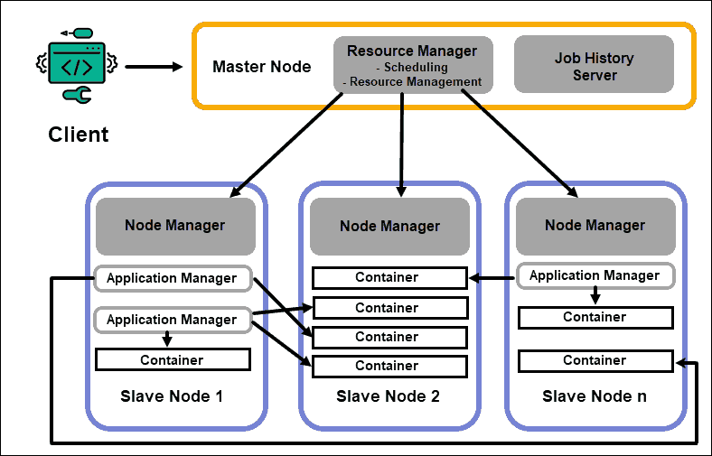

# What is Hadoop
Hadoop คือ Open-source software framework ที่มีเครื่องมือภายใน ecosystem ที่หลากหลาย และยืดหยุ่น เพื่อตอบโจทย์การประมวลผล หรือวิเคราะห์ Big data

# Hadoop Architecture
Hadoop จะมีรูปแบบเป็น Master-Slave Archtecture ซึ่งมีการวางเซิร์ฟเวอร์หลาย ๆ ตัวรวมกันเรียกว่า Hadoop Cluster โดยให้เครื่อง master คอยจัดการ และเครื่อง slave ทำ task ที่ได้รับ

# Hadoop Core Components
Hadoop ประกอบไปด้วย 4 ส่วนหลัก (components) ได้แก่ HDFS, YARN, MapReduce และ Common Utilities ตามรูปด้านล่าง

## MapReduce
คือวิธีการประมวลผลข้อมูลที่ถูกสร้างขึ้นด้วยภาษา Java โดยมีงานหลัก ๆ  ดังนี้
- **Map** รับข้อมูล ประมวลผล และสร้าง key-value pair (tuple) จำนวนงาน (task) ของ Map ขึ้นอยู่กับขนาด และชนิดของข้อมูลที่รับเข้ามา
- **Reduce** รับ key-value pair จากการทำ Map หลังจากนั้นจะ shuffles, sorts, aggregates จนกลายเป็นเซ็ทที่เล็กลงของ tuple ไปเก็บไว้ใน HDFS

## Hadoop Distributed File System (HDFS)
เป็นส่วนหลักในการจัดเก็บข้อมูลที่อยู่บน server หลายตัว ข้อมูลจะถูกแบ่งออกเป็นบล็อก ๆ ตามขนาดของข้อมูล แต่ละบล็อกข้อมูลจะมีขนาดไม่เกิน 128 MB ถูกทำซ้ำอีก 3 ครั้ง และจัดเก็บท่ามกลาง node และ rack ที่เรามีทั้งหมด

**Data Node** ทำหน้าที่ประมวลผล และจัดเก็บบล็อกข้อมูล ส่วน **Name Node** ดูแลจัดการ Data Node เก็บบล็อก metadata และควบคุมการเข้าถึงของ client

### Name Node
เป็นที่จัดเก็บที่มาของข้อมูล (metadata) ของบล็อกข้อมูลทั้งหมด เช่น ชื่อไฟล์, การเข้าถึงไฟล์, ID, ที่จัดเก็บ, จำนวนที่ทำซ้ำ จะถูกเก็บไว้ใน fsimage บนหน่วยความจำของ Name Node

### Secondary Name Node
เป็น backup ของ Name Node โดยจะโหลดข้อมูล fsimage, แก้ไข log จาก Name Node และรวมเข้าด้วยกัน fsimage ที่แก้ไขแล้วสามารถดึงข้อมูลกลับมายัง Name Node หลักเพื่อใช้แทน fsimage ที่เสียได้

### Data Node
แต่ละ Data Node ใน cluster จะใช้การประมวลผลเบื้องหลัง (background process) ในการเก็บบล็อกข้อมูลบน slave server

Data Node จะสื่อสาร และรับคำสั่งจาก Name Node ประมาณ 20 ครั้งต่อนาที และ Data Node จะรายงานสถานะ และความสมบูรณ์ของบล็อกข้อมูลกลับไป Name Node ชั่วโมงละครั้ง นอกจากนี้ Name Node ยังสามารถสั่งให้สร้าง-ลบบล็อกข้อมูลที่ทำซ้ำ หรือลดจำนวนบล็อกข้อมูลในแต่ละ node ได้เช่นกัน

โดยปกติแล้ว HDFS จะสร้างบล็อกข้อมูลซ้ำเพิ่มมา 3 บล็อกเก็บในแต่ละ Data Node การจัดเก็บบล็อกข้อมูลจะเป็นไปตามกฏ **Rack Aware Placment** พูดสรุป ๆ เลยคือ Data Node จะไม่สามารถเก็บบล็อกข้อมูลทั้งหมดใน rack เดียวกัน

Rack คือ node หลาย ๆ node รวมกันใน cluster

### Rack Aware Placement Policy
กฏถูกสร้างขึ้นเพื่อเวลา rack เราพัง จะไม่ได้ทำให้บล็อกข้อมูลหลัก และบล็อกที่ทำซ้ำขึ้นมาหายไปทั้งหมด กฏมีดังต่อไปนี้
- บล็อกข้อมูลแรกจะถูกเก็บไว้ใน node เดียวกับ client
- บล็อกข้อมูลที่ 2 จะถูกสุ่มจัดเก็บไว้ใน node ที่อยู่คนละ rack กับบล็อกข้อมูลแรก
- บล็อกข้อมูลที่ 3 จะถูกเก็บไว้คนละ node กับบล็อกข้อมูลที่ 2 แต่อยู่ใน rack เดียวกัน
- บล็อกข้อมูลที่ถูกทำซ้ำเพื่มที่เหลือจะถูกสุ่มเก็บใน rack ทั้งหมดที่มี

กล่าวโดยสรุปคือกฏนี้บังคับให้บล็อกข้อมูลทั้งหมดจะไม่ถูกจัดเก็บใน Data Node เดียวกัน และจำกัดให้แต่ละ rack มีบล็อกข้อมูลไม่เกิน 2 บล็อก

rack มีโอกาสพังน้อยกว่า node แต่ HDFS ทำเพื่อให้ชัวว่าข้อมูลเราจะพร้อมใช้งาน และเก็บบล็อกข้อมูลไว้อย่างน้อย 1 บล็อกในแต่ละ rack บน cluster เรา

## Yet Another Resource Negotiater (YARN)
เป็นส่วนที่จัดการทรัพยากรภายใน Hadoop cluster ระหว่าง HDFS และการทำ MapReduce

### Resource Manager
ทำหน้าที่ควบคุมทรัพยากรที่ใช้ในการประมวบผลภายใน cluster ทั้งหมด จุดประสงค์หลักของมันคือ
1. การกำหนดทรัพยากรที่ใช้ให้แก่ application บน slave node 
2. ดูแลภาพรวมของ process ที่กำลังทำ และกำลังจะทำ 
3. รับมือกับความต้องการทรัพยากร จัดเวลาที่จะทำ และให้ทรัพยากรตามลำดับ
Resource Manager นั้นมีความสำคัญกับ Hadoop มาก และมันควรทำงานอยู่บน master node ที่มีการดูแลเป็นพิเศษ

### Node Manager
แต่ละ slave node จะมีส่วนของ Node Manager ดูแลเรื่องการประมวลผล และ Data Node ดูแลการเก็บข้อมูล

Data Node เป็นส่วนหนึ่งของ HDFS ที่ถูกควบคุมโดย Name Node ในทำนองเดียวกันนั้น Node Manaer ก็เป็น slave ของ Resource Manager มีการทำงานหลัก ๆ คือติดตามทรัพยากรที่ใช้ในการประมวลผลบน slave node ที่อยู่บน slave node เดียวกัน และส่งรายงานไปส่วน Resource Manager

### Containers
ทรัพยากรที่มีจะอยู่ใน Countainer ซึ่งประกอบไปด้วยหน่วยความจำ, ไฟล์ระบบ และพื้นที่ในการประมวลผล

การสร้าง container จะเกิดขึ้นบ่อยมาก และสามารถจัดการคำร้องขอ (request) บนระบบ ถ้าจำนวนของคำร้องขอทรัพยากรของ cluster นั้นไม่เกินข้อจำกัดที่ยอมรับได้ Resource Manager จะอนุญาติ และจัดหาเวลาที่ Container จะถูกสร้างขึ้นให้

การทำงานของ Container จะถูกเตรียม ตรวจสอบ และติดตามโดย Node manager บน slave node เดียวกัน

### Application Master
ทุก Container บน slave node จะมี Application Master ของตัวเอง Application Master จะถูกสร้างขึ้นมาพร้อมกับ Container แม้แต่ MapReduce ยังมี Aplication Master ที่ทำ Map และ Reduce

ระหว่าง Aplication Master ทำงาน จะส่งข้อความไปยัง Resource Manager เกี่ยวกับสถานะของ application ที่กำลังดูอยู่ ด้วยข้อมูลดังกล่าวทำให้ Resource Manager สามารถจัดหาทรัพยากร หรือจัดให้ทำงาน task อื่น ๆ เมื่อทำ task ปัจจุบันเสร็จแล้วได้

Application Master จะควบคุมดูแล lifecycle ของ aplication ตั้งแต่การร้องขอการใช้งาน container จาก Resource Manager แล้วถึงปล่อย container ที่ทำงานเสร็จแล้วให้ Node Manager

### Job History Server
คือที่ที่ผู้ใช้สามารถรับข้อมูลว่า application ไหนทำสำเร็จ สามารถทำงานร่วมกับ REST API เพื่อดู job ที่กำลังอยู่ และเสร็จแล้วบน server

### How Does YARN Work?
การทำงานจะเริ่มเมื่อผู้ใช้งานส่งคำขอไปที่ Resource Manager
1. Resource Manager จะสั่งให้ Node Managder เริ่มการทำงานของ Aplication Master สำหรับคำขอดังกล่าว ซึ่งจะเริ่มใน container
2. Application Master ที่สร้างใหม่ไปลงทะเบียนกับ Resource Manager ติดต่อกับ HDFS Name Node เพื่อหาว่าบล็อกข้อมูลจะถูกเก็บที่ไหนรวมถึงคำนวณว่าต้องทำ Map และ Reduce กี่ครั้ง
3. Application Master ร้องขอทรัพยากรจาก Resource Manager และหาว่าต้องใช้ทรัพยากรเท่าไหรในการทำ
4. Resource Manager จัดทรัพยากร ร่วมกับการรับคำร้องขอจาก Application Master อื่น ๆ และเรียงลำดับคำร้องขอเหล่านั้น
5. Application Master ติดต่อ Node Manager เรื่อง slave node และขอให้สร้าง container โดยให้ variavle, authentication token และข้อความคำสั่ง เมื่อได้รับคำร้องขอ Node Manager จะสร้าง และเริ่มทำงาน container
6. Application Master จะติดตามผล หากทำไม่ผ่านจะเริ่มทำใหม่เมื่อมี slot แต่หาทำไม่ผ่านเกิน 4 ครั้งจะหยุดทำ และแจ้งผลไปให้ client รู้
7. เมื่อทำ task ทั้งหมดเสร็จแล้ว Application Master จะส่งผลลัพธ์ไปให้ client และบอก Resource Manager ว่าทำเสร็จแล้ว รวมถึงลงทะเบียนออก และปิดการทำงาน

Resource Manager สามารถสั่ง Name Node ให้หยุด container ได้ ในกรณีที่ต้องการ

# Reference
- [Apache Hadoop Architecture Explained (with Diagrams)](https://phoenixnap.com/kb/apache-hadoop-architecture-explained)
- [Hadoop – Rack and Rack Awareness](https://www.geeksforgeeks.org/hadoop-rack-and-rack-awareness/)