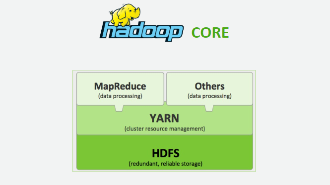

# What is Hadoop
Hadoop คือ Open-source software framework ที่มีเครื่องมือภายใน ecosystem ที่หลากหลาย และยืดหยุ่น เพื่อตอบโจทย์การประมวลผล หรือวิเคราะห์ Big data

# Hadoop Core Components
Hadoop ประกอบไปด้วย 3 ส่วนหลัก (components) ได้แก่ HDFS, YARN และ MapReduce ตามรูปด้านล่าง

## Hadoop Distributed File System (HDFS)
## Yet Another Resource Negotiater (YARN)
## MapReduce
