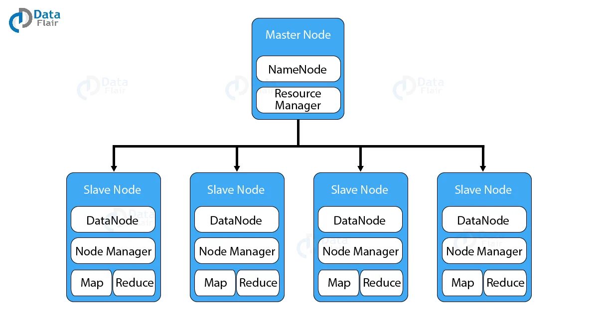
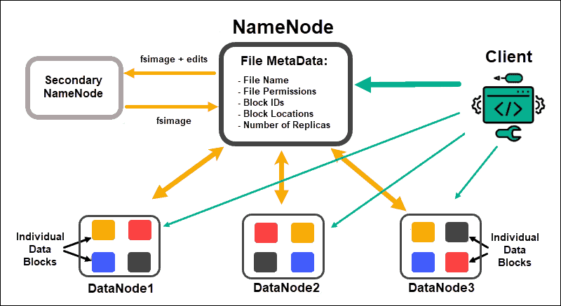
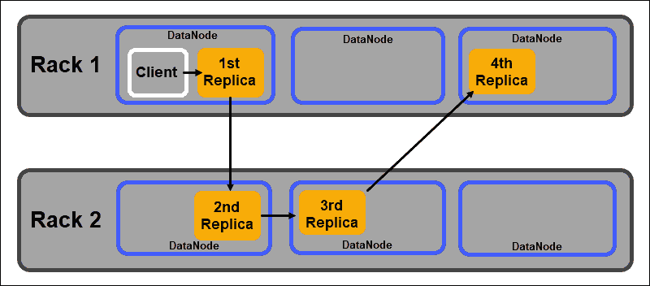

# What is Hadoop
Hadoop คือ Open-source software framework ที่มีเครื่องมือภายใน ecosystem ที่หลากหลาย และยืดหยุ่น เพื่อตอบโจทย์การประมวลผล หรือวิเคราะห์ Big data

# Hadoop Architecture
Hadoop จะมีรูปแบบเป็น Master-Slave Archtecture ซึ่งมีการวางเซิร์ฟเวอร์หลาย ๆ ตัวรวมกันเรียกว่า Hadoop Cluster โดยให้เครื่อง master คอยจัดการ และเครื่อง slave ทำ task ที่ได้รับ

# Hadoop Core Components
Hadoop ประกอบไปด้วย 4 ส่วนหลัก (components) ได้แก่ HDFS, YARN, MapReduce และ Common Utilities ตามรูปด้านล่าง

## MapReduce
คือวิธีการประมวลผลข้อมูลที่ถูกสร้างขึ้นด้วยภาษา Java โดยมีงานหลัก ๆ  ดังนี้
- **Map** รับข้อมูล ประมวลผล และสร้าง key-value pair (tuple) จำนวนงาน (task) ของ Map ขึ้นอยู่กับขนาด และชนิดของข้อมูลที่รับเข้ามา
- **Reduce** รับ key-value pair จากการทำ Map หลังจากนั้นจะ shuffles, sorts, aggregates จนกลายเป็นเซ็ทที่เล็กลงของ tuple ไปเก็บไว้ใน HDFS

## Hadoop Distributed File System (HDFS)
เป็นส่วนหลักในการจัดเก็บข้อมูลที่อยู่บน server หลายตัว ข้อมูลจะถูกแบ่งออกเป็นบล็อก ๆ ตามขนาดของข้อมูล แต่ละบล็อกข้อมูลจะมีขนาดไม่เกิน 128 MB ถูกทำซ้ำอีก 3 ครั้ง และจัดเก็บท่ามกลาง node และ rack ที่เรามีทั้งหมด

**DataNode** ทำหน้าที่ประมวลผล และจัดเก็บบล็อกข้อมูล ส่วน **NameNode** ดูแลจัดการ DataNode เก็บบล็อก metadata และควบคุมการเข้าถึงของ client

### NameNode
เป็นที่จัดเก็บที่มาของข้อมูล (metadata) ของบล็อกข้อมูลทั้งหมด เช่น ชื่อไฟล์, การเข้าถึงไฟล์, ID, ที่จัดเก็บ, จำนวนที่ทำซ้ำ จะถูกเก็บไว้ใน fsimage บนหน่วยความจำของ NameNode

### Secondary NameNode
เป็น backup ของ NameNode โดยจะโหลดข้อมูล fsimage, แก้ไข log จาก NameNode และรวมเข้าด้วยกัน fsimage ที่แก้ไขแล้วสามารถดึงข้อมูลกลับมายัง NameNode หลักเพื่อใช้แทน fsimage ที่เสียได้

### DataNode
แต่ละ DataNode ใน cluster จะใช้การประมวลผลเบื้องหลัง (background process) ในการเก็บบล็อกข้อมูลบน slave server

DataNode จะสื่อสาร และรับคำสั่งจาก NameNode ประมาณ 20 ครั้งต่อนาที และ Data Node จะรายงานสถานะ และความสมบูรณ์ของบล็อกข้อมูลกลับไป NameNode ชั่วโมงละครั้ง นอกจากนี้ NameNode ยังสามารถสั่งให้สร้าง-ลบบล็อกข้อมูลที่ทำซ้ำ หรือลดจำนวนบล็อกข้อมูลในแต่ละ node ได้เช่นกัน

โดยปกติแล้ว HDFS จะสร้างบล็อกข้อมูลซ้ำเพิ่มมา 3 บล็อกเก็บในแต่ละ DataNode การจัดเก็บบล็อกข้อมูลจะเป็นไปตามกฏ **Rack Aware Placment** พูดสรุป ๆ เลยคือ DataNode จะไม่สามารถเก็บบล็อกข้อมูลทั้งหมดใน rack เดียวกัน

Rack คือ node หลาย ๆ node รวมกันใน cluster

### Rack Aware Placement Policy
กฏถูกสร้างขึ้นเพื่อเวลา rack เราพัง จะไม่ได้ทำให้บล็อกข้อมูลหลัก และบล็อกที่ทำซ้ำขึ้นมาหายไปทั้งหมด กฏมีดังต่อไปนี้
- บล็อกข้อมูลแรกจะถูกเก็บไว้ใน node เดียวกับ client
- บล็อกข้อมูลที่ 2 จะถูกสุ่มจัดเก็บไว้ใน node ที่อยู่คนละ rack กับบล็อกข้อมูลแรก
- บล็อกข้อมูลที่ 3 จะถูกเก็บไว้คนละ node กับบล็อกข้อมูลที่ 2 แต่อยู่ใน rack เดียวกัน
- บล็อกข้อมูลที่ถูกทำซ้ำเพื่มที่เหลือจะถูกสุ่มเก็บใน rack ทั้งหมดที่มี

กล่าวโดยสรุปคือกฏนี้บังคับให้บล็อกข้อมูลทั้งหมดจะไม่ถูกจัดเก็บใน DataNode เดียวกัน และจำกัดให้แต่ละ rack มีบล็อกข้อมูลไม่เกิน 2 บล็อก

rack มีโอกาสพังน้อยกว่า node แต่ HDFS ทำเพื่อให้ชัวว่าข้อมูลเราจะพร้อมใช้งาน และเก็บบล็อกข้อมูลไว้อย่างน้อย 1 บล็อกในแต่ละ rack บน cluster เรา

## Yet Another Resource Negotiater (YARN)

# Reference
- [Apache Hadoop Architecture Explained (with Diagrams)](https://phoenixnap.com/kb/apache-hadoop-architecture-explained)
- [Hadoop – Rack and Rack Awareness](https://www.geeksforgeeks.org/hadoop-rack-and-rack-awareness/)